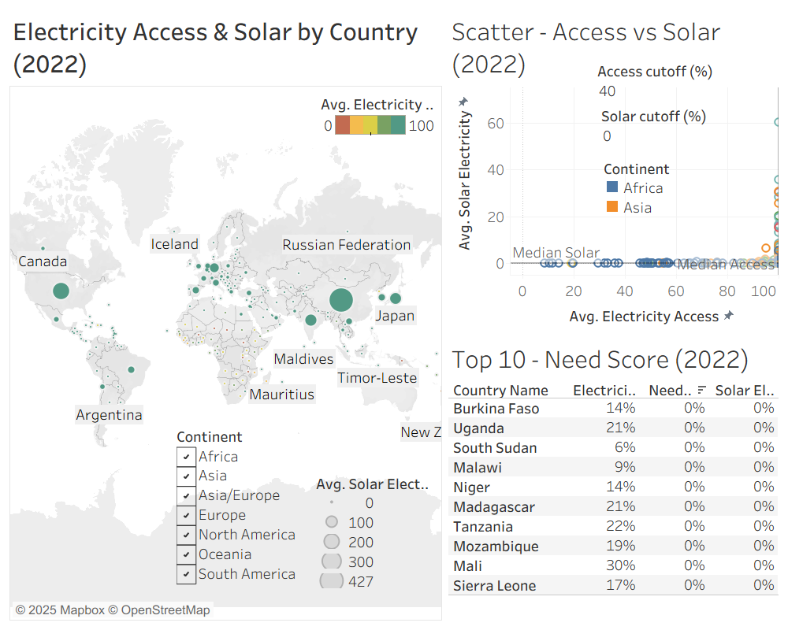

# Hi, I’m Charity 👋

Data/BI analyst who builds readable, decision-ready dashboards.

**Tools:** Excel, Tableau, SQL  
**Latest project:** Solar Targets (map + scatter + Top-10) highlighting high-impact countries  
**I care about:** clear visuals, simple parameters, stakeholder-friendly tooltips

**Links:** 
- [Tableau Public](https://public.tableau.com/app/profile/charity.mcdaniel)
- [GitHub Projects](https://github.com/charitymcdaniel?tab=repositories)
- [LinkedIn](<your LinkedIn URL>)

> Always aiming for insight over noise.
